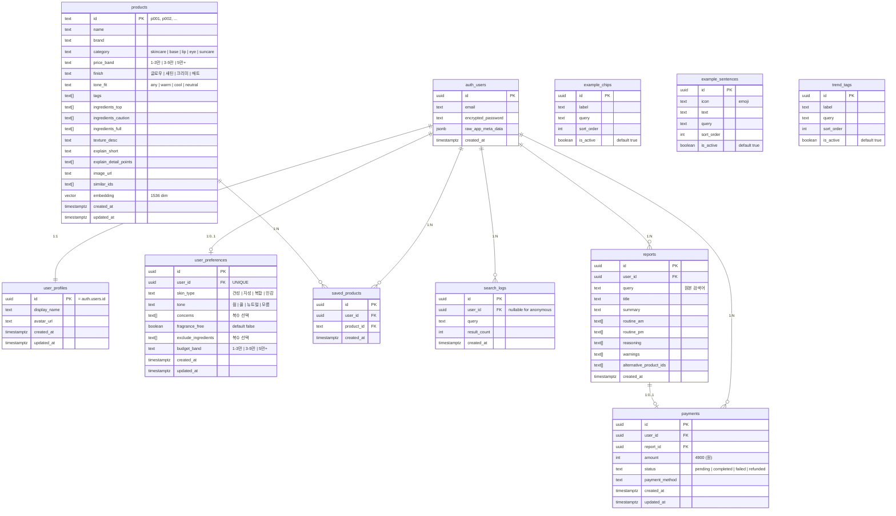

# ERD — K-Glow Database Schema

> **프로젝트**: K-Beauty Whisperer (K-Glow AI Search)
> **DB**: Supabase (PostgreSQL + pgvector)
> **참조**: `docs/BACKEND_DATA_IA.md`, `docs/front_mock/v1/`

---

## ER Diagram

---

## 테이블 상세 스펙

### 1. `user_profiles`

| 컬럼 | 타입 | 제약 | 설명 |
|---|---|---|---|
| `id` | `uuid` | PK, `= auth.users.id` | Supabase Auth ID와 동일 |
| `display_name` | `text` | nullable | 표시 이름 |
| `avatar_url` | `text` | nullable | 프로필 이미지 URL |
| `created_at` | `timestamptz` | NOT NULL, default `now()` | 생성 시각 |
| `updated_at` | `timestamptz` | NOT NULL, default `now()` | 수정 시각 |

**RLS**: 본인만 SELECT/UPDATE. INSERT는 Auth trigger.

---

### 2. `user_preferences`

| 컬럼 | 타입 | 제약 | 설명 |
|---|---|---|---|
| `id` | `uuid` | PK, default `gen_random_uuid()` | |
| `user_id` | `uuid` | FK → `auth.users(id)`, UNIQUE | 사용자당 1개 |
| `skin_type` | `text` | nullable | 건성, 지성, 복합, 민감 |
| `tone` | `text` | nullable | 웜, 쿨, 뉴트럴, 모름 |
| `concerns` | `text[]` | default `'{}'` | 홍조, 트러블, 속건조 등 |
| `fragrance_free` | `boolean` | default `false` | 무향 선호 |
| `exclude_ingredients` | `text[]` | default `'{}'` | 향료, 에탄올, 실리콘 등 |
| `budget_band` | `text` | nullable | 1-3만, 3-5만, 5만+ |
| `created_at` | `timestamptz` | NOT NULL, default `now()` | |
| `updated_at` | `timestamptz` | NOT NULL, default `now()` | |

**RLS**: 본인만 SELECT/UPDATE/INSERT.

---

### 3. `products`

| 컬럼 | 타입 | 제약 | 설명 |
|---|---|---|---|
| `id` | `text` | PK | 예: `p001` |
| `name` | `text` | NOT NULL | 제품명 |
| `brand` | `text` | NOT NULL | 브랜드명 |
| `category` | `text` | NOT NULL | skincare, base, lip, eye, suncare |
| `price_band` | `text` | NOT NULL | 가격대 |
| `finish` | `text` | nullable | 글로우, 새틴, 크리미, 매트 |
| `tone_fit` | `text` | default `'any'` | any, warm, cool, neutral |
| `tags` | `text[]` | default `'{}'` | 태그 배열 |
| `ingredients_top` | `text[]` | default `'{}'` | 핵심 성분 |
| `ingredients_caution` | `text[]` | default `'{}'` | 주의 성분 |
| `ingredients_full` | `text[]` | default `'{}'` | 전체 성분표 |
| `texture_desc` | `text` | nullable | 사용감/제형 설명 |
| `explain_short` | `text` | nullable | AI 추천 요약 (1줄) |
| `explain_detail_points` | `text[]` | default `'{}'` | AI 추천 근거 포인트 |
| `image_url` | `text` | nullable | 제품 이미지 |
| `similar_ids` | `text[]` | default `'{}'` | 유사 제품 ID 배열 |
| `embedding` | `vector(1536)` | nullable | OpenAI 임베딩 벡터 |
| `created_at` | `timestamptz` | NOT NULL, default `now()` | |
| `updated_at` | `timestamptz` | NOT NULL, default `now()` | |

**RLS**: Public READ. Admin만 INSERT/UPDATE/DELETE.
**Index**: `embedding`에 `ivfflat` 또는 `hnsw` 벡터 인덱스.

---

### 4. `saved_products`

| 컬럼 | 타입 | 제약 | 설명 |
|---|---|---|---|
| `id` | `uuid` | PK, default `gen_random_uuid()` | |
| `user_id` | `uuid` | FK → `auth.users(id)`, NOT NULL | |
| `product_id` | `text` | FK → `products(id)`, NOT NULL | |
| `created_at` | `timestamptz` | NOT NULL, default `now()` | |

**UNIQUE**: `(user_id, product_id)` — 중복 저장 방지
**RLS**: 본인만 SELECT/INSERT/DELETE.

---

### 5. `search_logs`

| 컬럼 | 타입 | 제약 | 설명 |
|---|---|---|---|
| `id` | `uuid` | PK, default `gen_random_uuid()` | |
| `user_id` | `uuid` | FK → `auth.users(id)`, nullable | 비로그인 시 NULL |
| `query` | `text` | NOT NULL | 원본 검색 쿼리 |
| `result_count` | `int` | default `0` | 검색 결과 수 |
| `created_at` | `timestamptz` | NOT NULL, default `now()` | |

**RLS**: 본인만 SELECT. INSERT는 authenticated + anon.
**Index**: `user_id`, `created_at DESC`.

---

### 6. `reports`

| 컬럼 | 타입 | 제약 | 설명 |
|---|---|---|---|
| `id` | `uuid` | PK, default `gen_random_uuid()` | |
| `user_id` | `uuid` | FK → `auth.users(id)`, NOT NULL | |
| `query` | `text` | nullable | 기반 검색어 |
| `title` | `text` | NOT NULL | 리포트 제목 |
| `summary` | `text` | nullable | 요약 텍스트 |
| `routine_am` | `text[]` | default `'{}'` | AM 루틴 단계 |
| `routine_pm` | `text[]` | default `'{}'` | PM 루틴 단계 |
| `reasoning` | `text[]` | default `'{}'` | 조합 근거 |
| `warnings` | `text[]` | default `'{}'` | 주의 조합 |
| `alternative_product_ids` | `text[]` | default `'{}'` | 대체 제품 ID 배열 |
| `created_at` | `timestamptz` | NOT NULL, default `now()` | |

**RLS**: 본인만 SELECT. INSERT는 서버(Edge Function)에서만.
**Index**: `user_id`, `created_at DESC`.

---

### 7. `payments`

| 컬럼 | 타입 | 제약 | 설명 |
|---|---|---|---|
| `id` | `uuid` | PK, default `gen_random_uuid()` | |
| `user_id` | `uuid` | FK → `auth.users(id)`, NOT NULL | |
| `report_id` | `uuid` | FK → `reports(id)`, nullable | 연결 리포트 |
| `amount` | `int` | NOT NULL | 결제 금액 (원) |
| `status` | `text` | NOT NULL, default `'pending'` | pending, completed, failed, refunded |
| `payment_method` | `text` | nullable | 결제 수단 |
| `created_at` | `timestamptz` | NOT NULL, default `now()` | |
| `updated_at` | `timestamptz` | NOT NULL, default `now()` | |

**RLS**: 본인만 SELECT. INSERT/UPDATE는 서버에서만.

---

### 8. `example_chips`

| 컬럼 | 타입 | 제약 | 설명 |
|---|---|---|---|
| `id` | `uuid` | PK, default `gen_random_uuid()` | |
| `label` | `text` | NOT NULL | 칩 표시 텍스트 |
| `query` | `text` | NOT NULL | 클릭 시 검색 쿼리 |
| `sort_order` | `int` | default `0` | 정렬 순서 |
| `is_active` | `boolean` | default `true` | 활성 여부 |

**RLS**: Public READ. Admin만 WRITE.

---

### 9. `example_sentences`

| 컬럼 | 타입 | 제약 | 설명 |
|---|---|---|---|
| `id` | `uuid` | PK, default `gen_random_uuid()` | |
| `icon` | `text` | nullable | 아이콘 (이모지) |
| `text` | `text` | NOT NULL | 문장 내용 |
| `query` | `text` | NOT NULL | 클릭 시 검색 쿼리 |
| `sort_order` | `int` | default `0` | |
| `is_active` | `boolean` | default `true` | |

**RLS**: Public READ. Admin만 WRITE.

---

### 10. `trend_tags`

| 컬럼 | 타입 | 제약 | 설명 |
|---|---|---|---|
| `id` | `uuid` | PK, default `gen_random_uuid()` | |
| `label` | `text` | NOT NULL | 태그 표기 |
| `query` | `text` | NOT NULL | 클릭 시 검색 쿼리 |
| `sort_order` | `int` | default `0` | |
| `is_active` | `boolean` | default `true` | |

**RLS**: Public READ. Admin만 WRITE.

---

## RLS 정책 요약

| 테이블 | anon | authenticated (본인) | service_role |
|---|---|---|---|
| `products` | R | R | CRUD |
| `user_profiles` | — | R/U (own) | CRUD |
| `user_preferences` | — | R/U/C (own) | CRUD |
| `saved_products` | — | R/C/D (own) | CRUD |
| `search_logs` | C | R/C (own) | CRUD |
| `reports` | — | R (own) | R/C |
| `payments` | — | R (own) | R/C/U |
| `example_chips` | R | R | CRUD |
| `example_sentences` | R | R | CRUD |
| `trend_tags` | R | R | CRUD |
